# HOTEL ALURA
Oracle Next Education + Alura Latam.

     

---

## Descripción
Aplicación tipo CRUD en lenguaje Java desarrollada en Eclipse con Windows Builder, J Calendar y MySQL para reservas de hotel.

## Ventanas
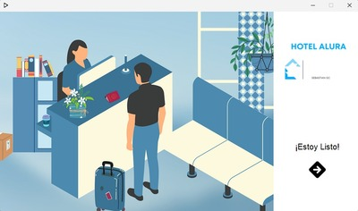                

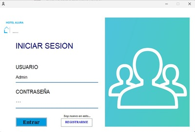      

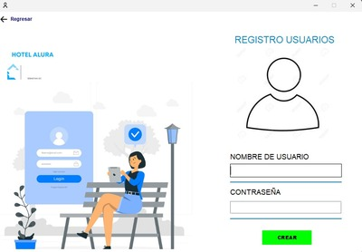                       

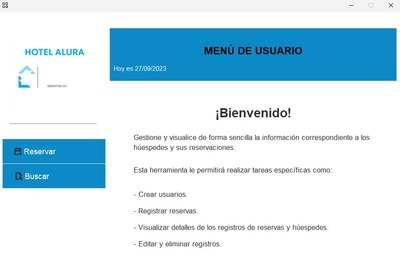      

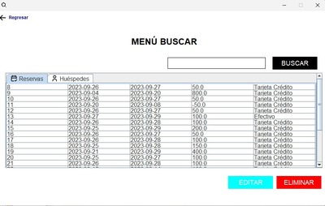                       

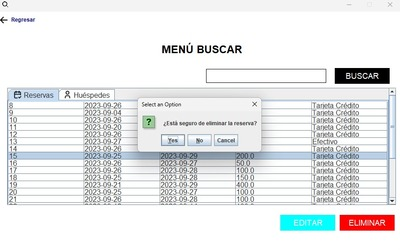      

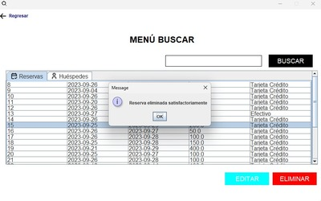      

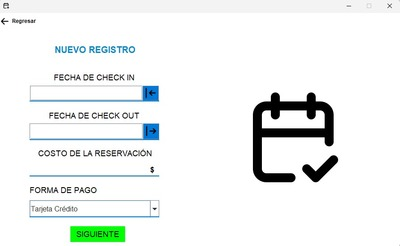      

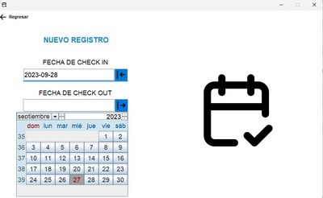      

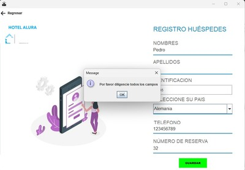      

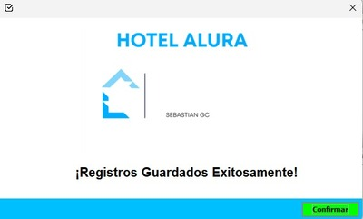      

## ¿Cómo Ejecutar?
- Descargue los archivos del proyecto en su ordenador o clone el repositorio.
- Verifique la instalación correcta de las siguientes librerías:  
*c3p0-0.9.5.4.jar 
*jcalendar-1.4.jar 
*mchange-commons-java-0.2.16.jar 
*mysql-connector-java-8.0.17.jar 
- Inicie su entorno de desarrollo, abra el proyecto y a continuación exportelo como archivo JAR ejecutable (Runnable JAR File).
- Se creará un archivo ejecutable que le permitirá interactuar con la aplicación.

## Autor
- Sebastián García Carmona (Sebastián GC)
- 2023

----------------------------------------------------------------------------------------------------------------------------------------------------------------------------------------

